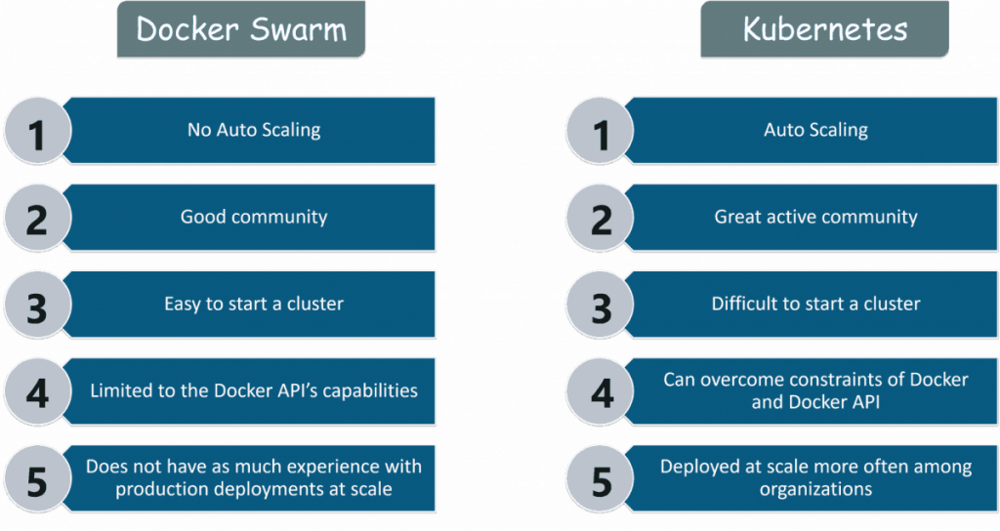

# Kubernetes(K8)

- Kubernetes is a open-source container **orchestrator** 

- Kubernetes clusters together groups of hosts running containers, and helps you easily and efficiently manage those clusters.

- It is used for automating deployment, scheduling and scaling of containerized applications, and supports many containerization tools such as Docker.
- Benefits:
    - Self Healing
    - Load Balancing and Service Dicov 
    - Automated rollouts and rollback
    - Auto Scaling 
    - Automatic bin packing 
    - Storage orchestration 

## Kubernetes Architecture and Terminology 

## Kubernetes vs Docker

- Docker is the main container virtualization standard used with Kubernetes.

## Kubernetes Use Case Scenario 

#### Tinder’s Move to Kubernetes
- **Problem**:
Due to high traffic volume, Tinder’s engineering team faced challenges of scale and stability.  

- **Solution**:
We started by containerizing all of our services and deploying them to a series of Kubernetes hosted staging environments.

**Cluster Sizing**

We decided to use kube-aws for automated cluster provisioning on Amazon EC2 instances. Early on, we were running everything in one general node pool. We quickly identified the need to separate out workloads into different sizes and types of instances, to make better use of resources. The reasoning was that running fewer heavily threaded pods together yielded more predictable performance results for us than letting them coexist with a larger number of single-threaded pods.

We settled on:
- m5.4xlarge for monitoring (Prometheus)
- c5.4xlarge for Node.js workload (single-threaded workload)
- c5.2xlarge for Java and Go (multi-threaded workload)
- c5.4xlarge for the control plane (3 nodes)

**Migration**
One of the preparation steps for the migration from our legacy infrastructure to Kubernetes was to change existing service-to-service communication to point to new Elastic Load Balancers (ELBs) that were created in a specific Virtual Private Cloud (VPC) subnet. This subnet was peered to the Kubernetes VPC. This allowed us to granularly migrate modules with no regard to specific ordering for service dependencies.
These endpoints were created using weighted DNS record sets that had a CNAME pointing to each new ELB. To cutover, we added a new record, pointing to the new Kubernetes service ELB, with a weight of 0. We then set the Time To Live (TTL) on the record set to 0. The old and new weights were then slowly adjusted to eventually end up with 100% on the new server. After the cutover was complete, the TTL was set to something more reasonable.
Our Java modules honored low DNS TTL, but our Node applications did not. One of our engineers rewrote part of the connection pool code to wrap it in a manager that would refresh the pools every 60s. This worked very well for us with no appreciable performance hit.

